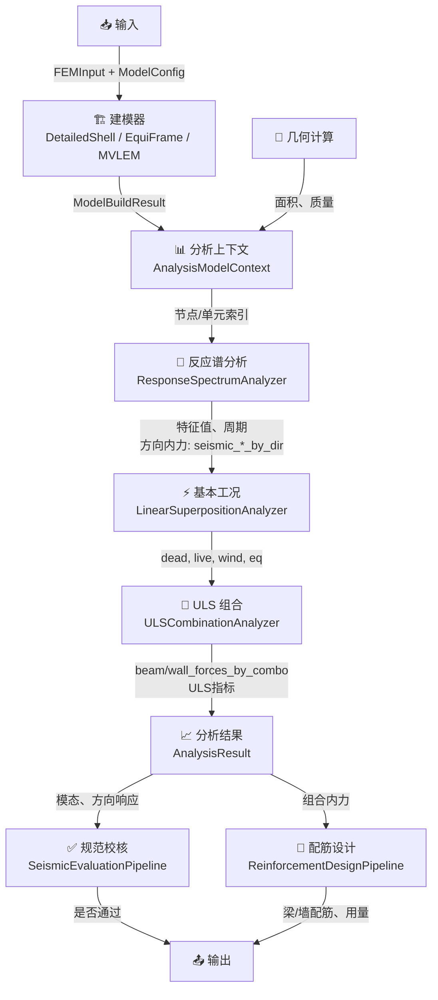

# shearwall_modeling

本目录负责把建筑结构输入转换为 OpenSees 模型，并完成分析、规范评估与配筋设计。

## 1. 总体分层

```text
shearwall_modeling/
|- core/       配置、常量、领域对象（ModelConfig、FEMInput 等）
|- geometry/   几何缩放、面积/自重估算
|- builders/   OpenSees 建模（壳单元、等效框架、MVLEM）
|- analysis/   模态+反应谱、基本工况、ULS 组合、规范校核
|- design/     基于分析结果的梁墙配筋需求提取与配筋计算
|- parametric/ 参数化输入生成
```

核心思想：

- `builders` 只负责“建模与模型元数据输出”。
- `analysis` 只负责“力学响应、组合与校核”。
- `design` 只负责“把分析需求转成配筋结果”。

## 2. 剪力墙建模流程

### 2.1 输入

- 几何与构件：`FEMInput`（墙、梁、节点拓扑）。
- 参数：`ModelConfig`（层高、材料分层、地震参数、组合方式等）。

### 2.2 建模器

建模器都实现 `StructuralModelBuilder` 接口，输出统一 `ModelBuildResult`。

- `DetailedShellBuilder`：墙用 `ShellMITC4` 离散，适合细化壳模型。
- `EquivalentFrameBuilder`：墙梁等效杆系，适合快速评估。
- `MVLEMFrameBuilder`：墙用 `MVLEM_3D`，梁用 `elasticBeamColumn`，楼板刚性约束。

`builders/registry.py` 维护默认注册表，可按名称切换建模器。

### 2.3 建模输出（统一）

`ModelBuildResult` 包含后续分析必需数据：

- `master_nodes`：各层主节点（楼板刚性约束中心）。
- `floor_story_nodes`：各层从节点集合。
- `beam_element_units` / `wall_story_element_units`：构件级单元索引与截面信息。
- `floor_load_masses` / `floor_self_masses`：荷载质量和结构自重质量通道。

## 3. 结构分析流程

入口是 `analysis/evaluation.py` 中 `AnalysisResultBuilder`，按以下顺序执行。

### 3.1 反应谱分析（RSA）

`ResponseSpectrumAnalyzer` 负责：

- 求模态：特征值、周期、主导平动/扭转模态。
- 对 X/Y 两个方向做反应谱计算。
- 提取方向内力结果：`seismic_beam_forces_by_dir`、`seismic_wall_forces_by_dir`。

### 3.2 基本工况分析（静力）

`LinearSuperpositionAnalyzer` 计算：

- `Dead`（恒载，含楼面自重）
- `Live`（活载）
- `WindX` / `WindY`（规范风荷载）
- `EqX` / `EqY`（直接采用 RSA 的方向结果）

基本工况输出为统一构件力字典：

- 梁：`(M_i, M_j, V_i)`
- 墙：`(N, M, V)`

### 3.3 ULS 组合与包络

`ULSCombinationAnalyzer` 以基本工况为输入：

- 按 `DEFAULT_COMBINATIONS` 计算构件组合内力。
- 输出 `beam_forces_by_combo`、`wall_forces_by_combo`。
- 生成墙/梁 ULS 指标（轴压比、剪压比及控制组合）。

### 3.4 分析结果对象

最终汇总到 `AnalysisResult`，仅保留当前链路必需信息：

- 模态与层响应：`modal_summary`、`direction_responses`。
- 设计输入：`beam_forces_by_combo`、`wall_forces_by_combo`。
- 校核输入：`wall_uls_metrics`、`beam_uls_metrics`。

## 4. 规范评估流程

`SeismicEvaluationPipeline` 基于 `AnalysisResult` 执行：

- 方向相关：扭转位移比、剪重比、刚度比、层间位移角。
- 非方向相关：周期比、墙轴压比/剪压比、连梁剪压比。

输出：

- `DirectionCheckResult`（X/Y 分方向结果）
- `OverallCheckResult`（总通过标志）

## 5. 配筋设计流程

入口是 `design/pipeline.py` 的 `ReinforcementDesignPipeline`。

### 5.1 需求提取

`DesignDemandExtractor` 直接使用 `AnalysisResult` 中组合结果：

- 梁：遍历所有组合，取正弯矩包络、负弯矩包络、剪力包络。
- 墙：遍历所有组合，取轴力/弯矩/剪力绝对值包络。

注意：当前设计链路已不再使用旧的“重力 + RSA”两步拼接。

### 5.2 配筋计算

- `BeamReinforcementDesigner`：纵筋 + 箍筋设计、超筋与截面不足判定。
- `WallReinforcementDesigner`：分布筋 + 边缘构件配筋与约束判定。

### 5.3 汇总输出

`ReinforcementDesignSummary` 给出：

- 梁/墙配筋结果列表
- 钢筋与混凝土用量
- 失败构件清单与总通过标志

## 6. 典型调用链

```python
build_result = builder.build(input_data, config)
context = AnalysisModelContext(build_result, config, logger)
analysis_result = AnalysisResultBuilder(context).build()
overall, dir_results = SeismicEvaluationPipeline(config).evaluate(analysis_result)
design = ReinforcementDesignPipeline(build_result, analysis_result, config, logger).run()
```

## 6.1 数据流与流程图

### 完整数据流



## 7. 开发约束（本目录）

- 新功能优先落到对应子包，不在顶层堆逻辑。
- 建模输出字段要保持统一，避免分析层感知具体建模器细节。
- 分析与配筋之间通过 `AnalysisResult` 解耦，禁止跨层直接读取 OpenSees 状态。
